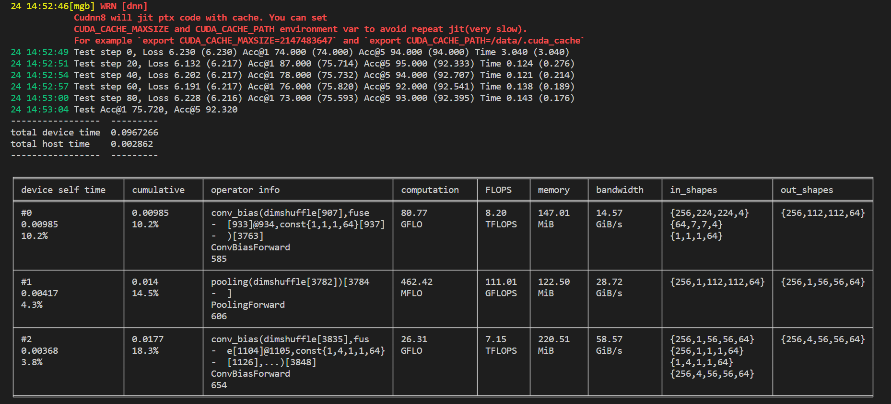
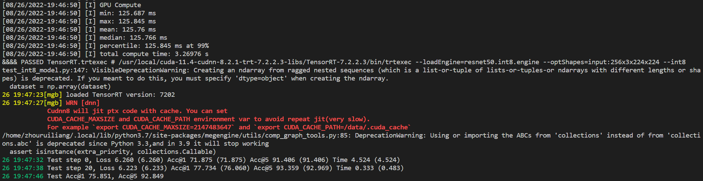

# Readme

本项目提供了 INT4 量化的 ResNet-50 模型在 [MegEngine](https://github.com/MegEngine/MegEngine) 下的推理的速度和精度测试以及 INT8 量化的 ResNet-50 模型在 TensorRT 下的速度和精度测试。

本项目包括:
- int8 目录下：
  1. [resnet50.onnx](./int8/resnet50.onnx)  一个标准的 ResNet-50 的 onnx 模型。
  2. [resnet50.int8.engine](./int8/resnet50.int8.engine) 在 CUDA11.4-CUDNN8.2.1-TRT7.2.2.3 以及 A2 卡下的环境下,通过 trtexec 和 ResNet-50.onnx 模型，得到的 TensorRT engine 文件。
  3. [test_int8.py](./int8/test_int8.py) 测试 INT8 量化的 ResNet-50 模型速度和精度的脚本。
- INT4 目录下：
  1. [resnet50.int4.mge](./int4/resnet50.int4.mge) 一个标准的 INT4 量化的 ResNet-50 的 MegEngine 模型。
  2. [test_int4.py](./int4/test_int4.py) 测试 INT4 量化的 ResNet-50 模型速度和精度的脚本。
- TODO：近期会补充 INT4 量化的 ResNet-50 模型的训练代码。


## 目录
<!-- TOC -->
  - [环境依赖](#环境依赖)
  - [数据准备](#数据准备)
  - [engine 生成](#engine-生成)
  - [测试](#测试)
<!-- /TOC -->

## 环境依赖
安装 CUDA 11.4 版本的 [MegEngine](https://github.com/MegEngine/MegEngine)

```sh
$ python3 -m pip install megengine==1.11.0+cu114 -f
```

## 数据准备
测试数据集来自于 [ImageNet (ILSVRC2012)](https://image-net.org/challenges/LSVRC/2012/)。
```sh
$ mkdir data && cd data && mkdir img
```
将测试图片放入 data/img 目录下；将对应图片顺序的 label ，放到 data 目录下，使用 numpy 保存，并命名为 label.npy（其内容就是一维数组）。

## engine 生成

如果你使用的环境并非上述指定的软件环境以及 A2 卡。则需要为 INT8 量化的 ResNet-50 模型重新生成 TensorRT engine 文件。

```sh
$ trtexec  --onnx=ResNet-50.onnx --optShapes=input:256x3x224x224 --int8 --saveEngine=resnet50.int8.engine
```

## 测试
- INT4
```sh
$ cd int4
$ python3 test_int4.py -d data/ -m resnet50.int4.mge
```
- INT8
```sh
$ cd int8
$ python3 test_int8.py -d data/ -m resnet50.int8.engine
```
- 在 CUDA11.4-CUDNN8.2.1-TRT7.2.2.3 以及 A2 卡下的环境下的测试结果：

|        |  速度（ms）   | top1 精度 | top5 精度 |
|  ----  |  ----   | ----  | ---- |
| INT4  | 96.73 | 75.720 | 92.320 |
| INT8  | 125.76 | 75.851 | 92.849 |



